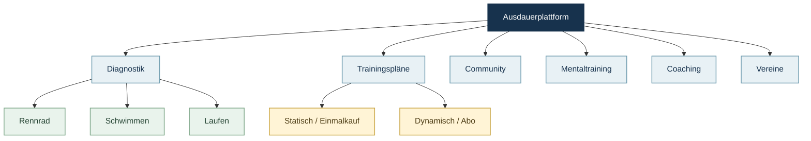

# Ausdauerplattform: Module

```mermaid
flowchart TB
    platform[Ausdauerplattform]

    platform --> diagnostics[Diagnostik]
    platform --> plans[Trainingspläne]
    platform --> community[Community]
    platform --> mental[Mentaltraining]
    platform --> coaching[Coaching]
    platform --> clubs[Vereine]

    diagnostics --> roadbike[Rennrad]
    diagnostics --> swim[Schwimmen]
    diagnostics --> run[Laufen]

    plans --> static[Statisch / Einmalkauf]
    plans --> dynamic[Dynamisch / Abo]

    classDef platform fill:#17324d,color:#ffffff,stroke:#17324d,stroke-width:2px;
    classDef module fill:#e8f1f5,color:#17324d,stroke:#6f9caf,stroke-width:1.5px;
    classDef offer fill:#fff4d6,color:#4b3b13,stroke:#c9a646,stroke-width:1.5px;
    classDef discipline fill:#e9f3ec,color:#254433,stroke:#7fa88a,stroke-width:1.5px;

    class platform platform;
    class diagnostics,plans,community,mental,coaching,clubs module;
    class static,dynamic offer;
    class roadbike,swim,run discipline;
```

Weitere Plattformmodule können direkt unter `Ausdauerplattform` ergänzt werden.
