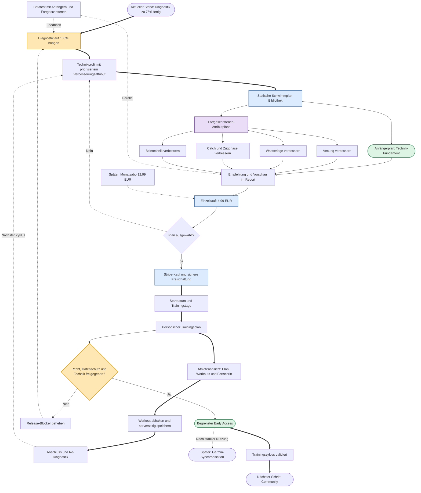

# Schwimmplattform: Roadmap

Dieses Diagramm visualisiert die nächsten Produktmeilensteine. Es kann in VS Code mit einer Mermaid-Erweiterung oder in der Markdown-Vorschau angezeigt werden.

## Produktlogik

- Der Anfängerplan ist der Einstieg ohne komplexe Diagnostik-Auswahl.
- Fortgeschrittene erhalten einen Plan für das priorisierte Technik-Attribut.
- Der Einzelkauf ist der erste Verkaufsmeilenstein.
- Das Monatsabo bleibt ein späterer Ausbau und ist kein Bestandteil des ersten Kauf-Slices.
- Betatest und Verkaufsentwicklung laufen parallel.
- Der Athlet kann den persönlichen Plan in der Plattform ansehen, Einheiten öffnen und Workouts abhaken.
- Garmin folgt erst nach stabiler manueller Nutzung; die Synchronisation braucht OAuth, Einwilligung, externe Aktivitäts-IDs, Idempotenz und eine nachvollziehbare Zuordnung zu Planeinheiten.
- Community startet erst nach einem validierten Zyklus aus Diagnostik, Empfehlung, Training und Re-Diagnostik mit echten Nutzern.
- Garmin ist dafür keine Voraussetzung und bleibt ein separater Integrationspfad.
